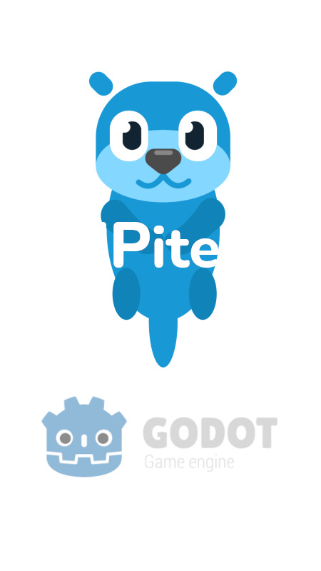

#  GGJ 2021

[![release][1]][2] [![license][7]][8]

GGJ2021 is a **game** for 💻**PC** / 🌐**Web** /📱**Android**.

<!---  --->

## Install & Setup

1. Download the 💻*binary* or 📱*apk* from **[releases](https://github.com/GreenDjango/GGJ2021/releases)**
2. Run the app
5. Enjoy with `???` !
6. Optional: `rm -rf *` for delete all your pc

---

[1]: https://img.shields.io/badge/release-v0.1.0-blue
[2]: https://github.com/GreenDjango/GGJ2021/releases 'GitHub release (latest by date)'
[7]: https://img.shields.io/badge/license-MIT-green
[8]: https://github.com/GreenDjango/GGJ2021/blob/master/LICENSE 'GitHub license'
